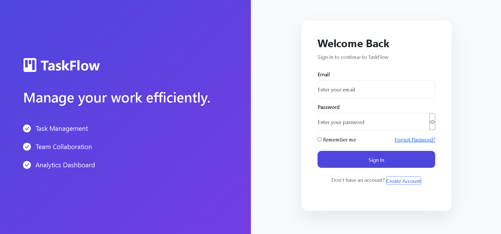
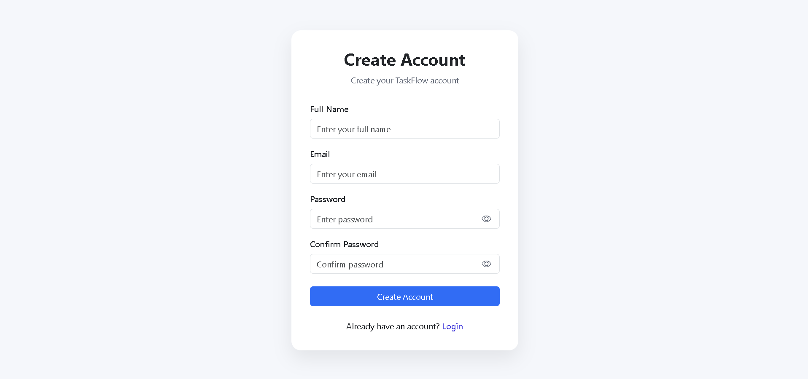
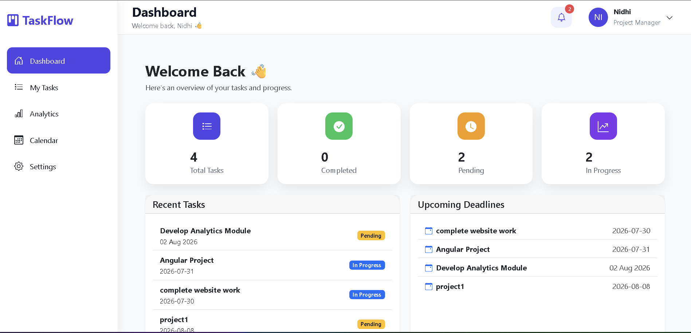
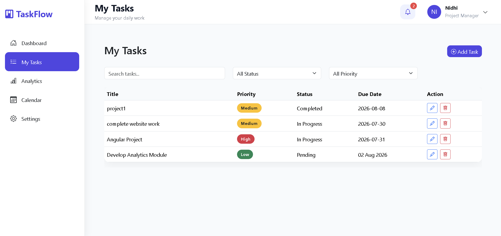
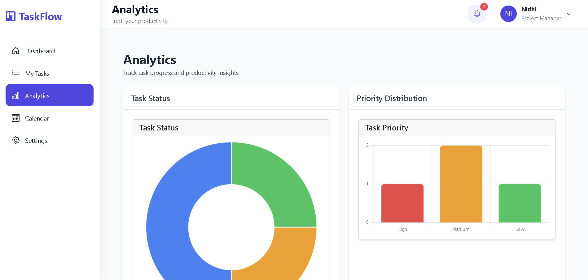
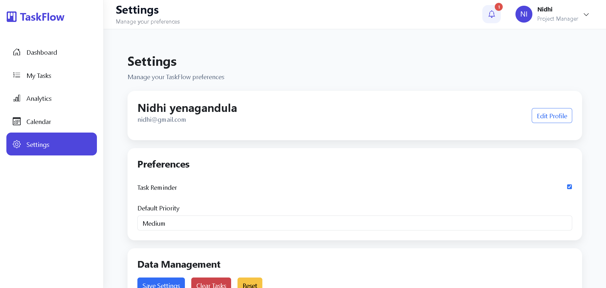

# TaskFlow

A modern task management application built with Angular.

## Features

- User Login & Registration
- Dashboard
- Task Management (CRUD)
- Calendar
- Analytics
- Notifications
- User Profile
- Responsive Design
- Local Storage Authentication

## Tech Stack

- Angular 21
- TypeScript
- Bootstrap 5
- SweetAlert2
- HTML5
- CSS3

## Installation

```bash
npm install
ng serve


# Screenshots

## Login


## Register


## Dashboard


## Tasks


## Calendar


## Analytics


## Settings

